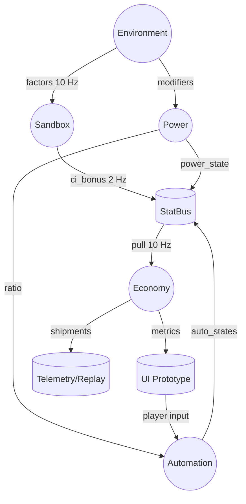

# Service Data Flow Diagram

> High-level view of signal flow between simulation services, StatBus, and UI. Use alongside [Overview](Overview.md) and [Signals & Events](Signals_Events.md).

- All nodes run on the main thread unless noted in PX-021.3 for future renderer workers.
- Telemetry pulls StatBus snapshots during replays; see [Telemetry & Replay](../quality/Telemetry_Replay.md).
