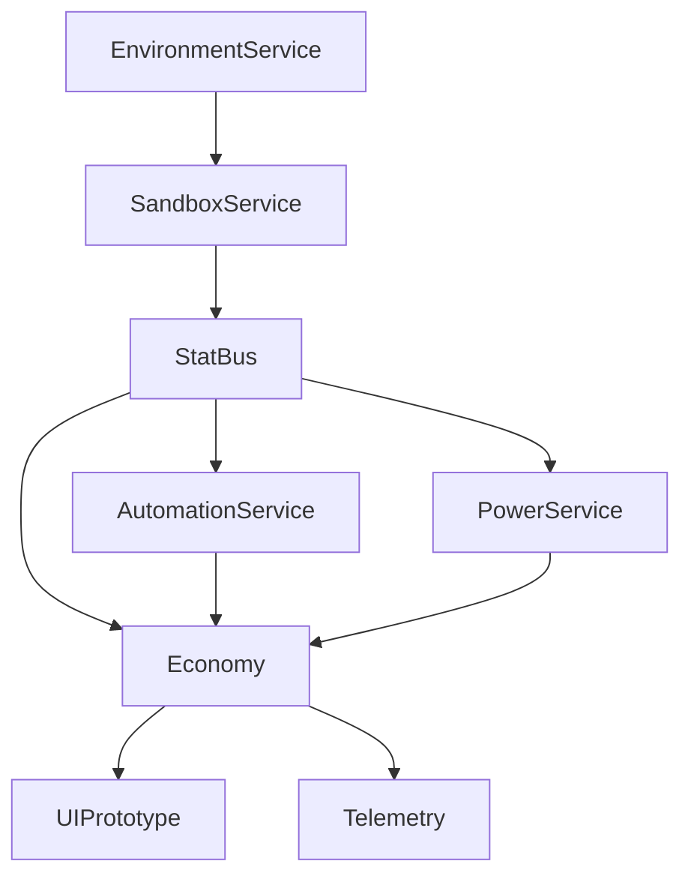
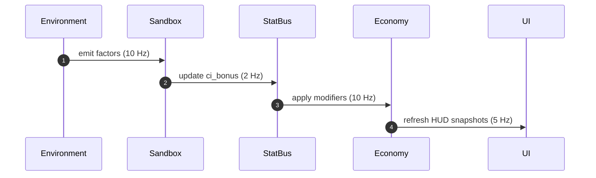

# Architecture Overview

> See [Glossary](../Glossary.md) for terminology.

> High-level map for Project Yolkless systems. This snapshot keeps comfort-idle pacing and serenity at the core while clarifying responsibilities.

## Environment Service
- Manages temperature, light, humidity, and air quality curves.
- Emits normalized factors at ~5 Hz to Sandbox and UI.
- Runs as an autoload, with CA-free logic for minimal frame cost.

## Sandbox Service
- Consumes environment factors and runs the 40×22 comfort simulation.
- Outputs Comfort Index and `ci_bonus` to StatBus and Economy.
- Update cadence 2–5 Hz with double buffering to prevent hitches.
- Current implementation runs a 40×22 CA grid and outputs stability/diversity metrics; further tuning tracked in `Implementation_TODO.md`.
- `SandboxGrid` is a `RefCounted` helper with typed `Array[Array]` buffers so it can be preloaded headless; when extending it, keep the typed buffers and Godot 4 conditional syntax (`value_if_true if condition else value_if_false`) to avoid parser regressions.
- Visual output flows through `src/sandbox/SandboxRenderer.gd`, mounted by `scenes/sandbox/SandboxCanvas.tscn` so `Main.gd` can replace the legacy environment root with the sandbox viewport when enabled.

## StatBus
- Lightweight stat aggregation layer (see `StatBus_Catalog.md`).
- Provides a single pull/push contract for UI, automation, and telemetry.
- Enforces stack rules (additive vs multiplicative) per key.

## Economy
- Core production/storage loop, prestige hooks, and live metrics.
- Subscribes to StatBus modifiers (comfort, power, events).
- Emits shipments, feed state, and PPS to UI and telemetry.

## UI Prototype
- RM-010 HUD renders metrics, feed ergonomics, and sheets.
- Uses signals from Economy/StatBus; maintains parity across desktop/mobile.
- Houses factory viewport; integrates environment visuals inside layout.

## Supporting Services
- AutomationService: schedules autobursts and machine toggles (~5 Hz).
- PowerService: tracks generation/consumption, informs automation (~5 Hz).
- EventDirector: dispatches gentle ±10% events with serene telemetry.
- Telemetry: captures StatBus snapshots for QA replay.

## Runtime Model
- Simulation runs single-threaded on the main loop during Phase A.
- Default cadence is 10 Hz; all updates happen in the following order:
  1. `EnvironmentService.tick(dt)` updates factors and emits `environment_changed`.
  2. `PowerService.tick(dt)` pulls environment factors via `current_factors()`.
  3. `SandboxService.tick(dt)` pulls environment state, computes Comfort Index, emits `ci_changed`.
  4. `AutomationService.tick(dt)` reads StatBus modifiers and power state.
  5. `Economy.tick(dt)` pulls modifiers and applies totals (shipments, PPS, storage).
  6. UI/HUD refresh reads snapshots only—no heavy work in `_process`.
- StatBus is **pull by default**; services may optionally push high-latency changes via signals.
- No gameplay threads yet; any future GPU sandbox path must double-buffer results on the main thread.
- `SimulationClock` autoload currently orchestrates the fixed 10 Hz loop and enables services to opt-out of their legacy per-frame processing.

### Tick-Order Timeline

### Update Frequencies & Threading
- EnvironmentService: 10 Hz (main thread)
- PowerService / AutomationService / Economy: synchronous 10 Hz (main thread)
- SandboxService: logic 2–5 Hz (main thread); renderer optional worker thread (future shader path)
- UI: refreshed on demand, but heavyweight ops throttled to 5 Hz
- All signals emitted from the main thread unless otherwise noted; GPU/off-thread experiments must marshal back to main before touching SceneTree.

See also: [Architecture Alignment TODO](Implementation_TODO.md) for tasks needed to match this desired model.
See also: [Service Data Flow Diagram](DataFlow_Diagram.md) for a visual overview.
