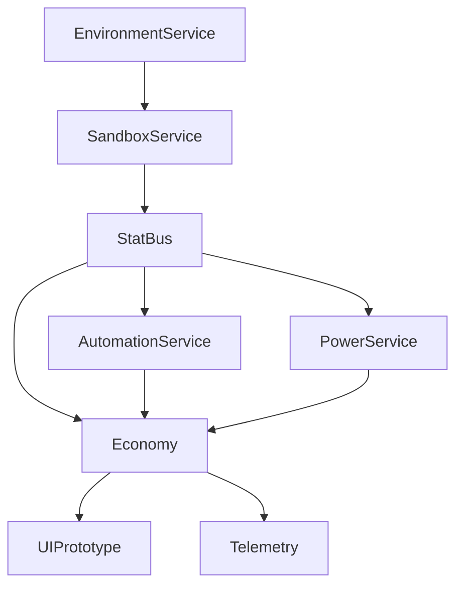

# Architecture Overview

> High-level map for Project Yolkless systems. This snapshot keeps comfort-idle pacing and serenity at the core while clarifying responsibilities.

## Environment Service
- Manages temperature, light, humidity, and air quality curves.
- Emits normalized factors at ~5 Hz to Sandbox and UI.
- Runs as an autoload, with CA-free logic for minimal frame cost.

## Sandbox Service
- Consumes environment factors and runs the 128×72 comfort simulation.
- Outputs Comfort Index and `ci_bonus` to StatBus and Economy.
- Update cadence 2–5 Hz with double buffering to prevent hitches.

## StatBus
- Lightweight stat aggregation layer (see `StatBus_Catalog.md`).
- Provides a single pull/push contract for UI, automation, and telemetry.
- Enforces stack rules (additive vs multiplicative) per key.

## Economy
- Core production/storage loop, prestige hooks, and live metrics.
- Subscribes to StatBus modifiers (comfort, power, events).
- Emits shipments, feed state, and PPS to UI and telemetry.

## UI Prototype
- RM-010 HUD renders metrics, feed ergonomics, and sheets.
- Uses signals from Economy/StatBus; maintains parity across desktop/mobile.
- Houses factory viewport; integrates environment visuals inside layout.

## Supporting Services
- AutomationService: schedules autobursts and machine toggles (~5 Hz).
- PowerService: tracks generation/consumption, informs automation (~5 Hz).
- EventDirector: dispatches gentle ±10% events with serene telemetry.
- Telemetry: captures StatBus snapshots for QA replay.

