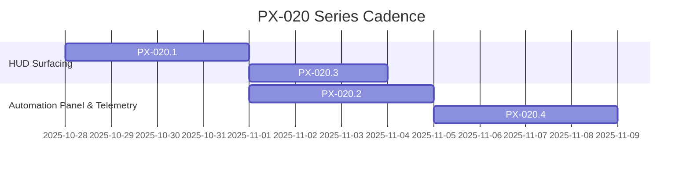

# PX-020.0 — Economy / Conveyor + GUI Integration Overview

> Anchor document for the PX-020 series.  Tracks how economy flow, conveyor telemetry, and HUD affordances converge so production clarity improves without sacrificing the calm tone.

## Goals
- Present production pace and conveyor health directly on the HUD so players glance once and know whether to nurture the farm or intervene.
- Ensure UI surfaces (HUD slots, Automation Panel, tooltip layers) stay in sync with StatBus + telemetry so LiveOps can trust recorded data.
- Keep copy, colors, and tooltips aligned with the [UI Baseline Layout Spec](../ui_baselines/README_UI_BASELINE_LAYOUT.md) and [UI Matrix](../ui_baselines/ui_matrix.md) contracts.
- Close the loop between in-session validation (`tools/ui_assert_baseline.py`, `tools/replay_headless.gd`) and roadmap reporting so PX-020 remains auditable.

## Dependencies & Inputs
- [Economy module brief](../modules/economy.md) and [Conveyor module brief](../modules/conveyor.md) for signal + StatBus ownership.
- [Signals & Events](../architecture/Signals_Events.md) for contract definitions shared across PX-013 automation work.
- [StatBus Catalog](../architecture/StatBus_Catalog.md) for telemetry nomenclature.
- [PX-013.2 Automation HUD](../prompts/PX-013.2.md) because the Automation Panel interactions extend that foundation.
- [Shipping Implementation Plan](../roadmap/Shipping_Implementation_Plan.md) to respect release ordering and validation gates.

## Deliverables
| PX ID | Focus | Key Deliverables | Acceptance Snapshot |
| --- | --- | --- | --- |
| PX-020.1 | HUD wiring | Slot D/F layout, `economy_rate_changed` + `conveyor_backlog_changed` docs, StatBus + replay visibility | HUD baselines + StatBus catalog updated, replay prints labels |
| PX-020.2 | Automation Panel interaction | Panel open/close/target signals, focus rules, StatBus automation target mirror | Signals + StatBus entries published, panel doc + UI tests updated |
| PX-020.3 | Tooltips + copy | Tone-reviewed HUD + panel copy, tooltip clamp map, localization-ready strings | Copy review sign-off, README_UI_BASELINE cross-links, pseudo-loc smoke |
| PX-020.4 | Telemetry + replay | Replay quickstart addendum, HUD label logging, CI hook blueprint | Replay guide updated, CI note in Shipping Plan, telemetry artifacts linked |

## Flow & Cadence

- PX-020.1 must land before PX-020.2 so Automation Panel slots can bind to live stats.
- PX-020.3 can overlap late PX-020.1 testing but must complete before PX-020.4 to lock copy for telemetry screenshots/pseudo-loc.

## Acceptance Criteria
- Every PX-020 sub-doc lists goals, dependencies, deliverables, and acceptance blocks that cross-link to architecture + UI baselines.
- Signals + StatBus entries referenced by PX-020 each exist (and only once) in `docs/architecture/Signals_Events.md` and `docs/architecture/StatBus_Catalog.md`.
- Roadmap + index references resolve: [PX-020 Series Roadmap](../roadmap/PX_20_Series_Roadmap.md) and site navigation both link to the PX docs.
- No code or asset edits are required for this phase; documentation captures intent well enough for implementation teams to proceed.
