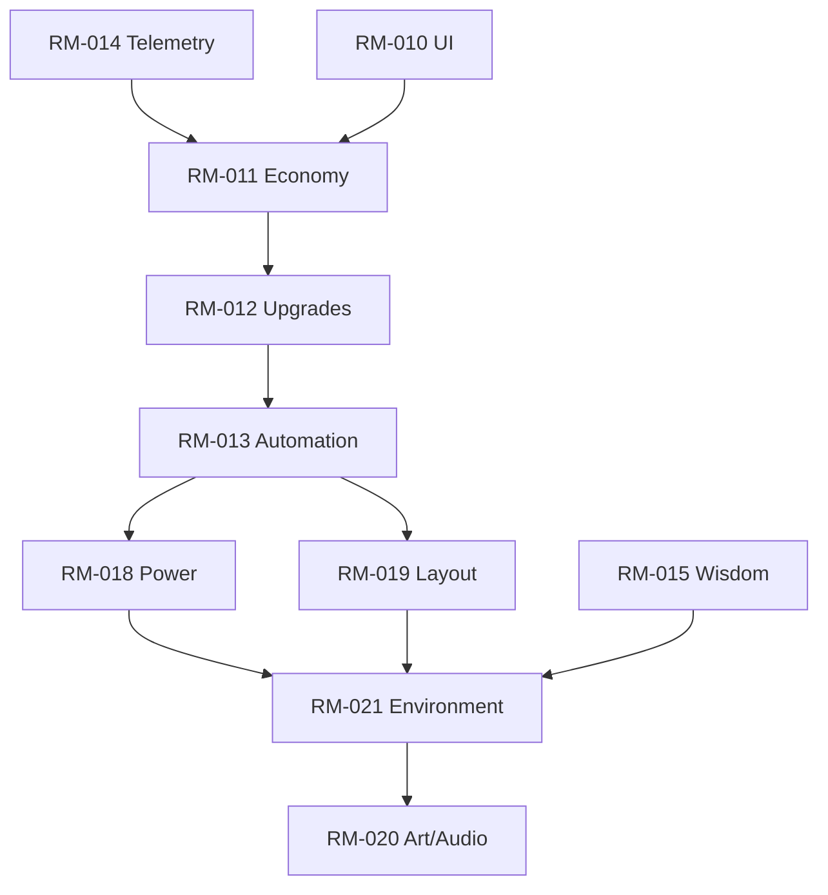

# Roadmap Index

> Master reference for RM/PX documents and supporting guides. See `/docs/design/Fun_Fantasy_Expansion_Canvas.md` for emotional design targets introduced in the Fun & Fantasy sweep.

## Modules
| RM | Summary | Key Docs |
| -- | ------- | -------- |
| [RM-009](RM/RM-009.md) | Conveyor visuals & throughput | [ADR-0001](../adr/ADR-0001_conveyor-fidelity.md), [Performance Budgets](../quality/Performance_Budgets.md) |
| [RM-010](RM/RM-010.md) | UI & control architecture | [docs/design/UX_Principles.md](../design/UX_Principles.md), [Style Guide](../art/Style_Guide.md), [PX-010.2](../prompts/PX-010.2.md), [PX-010.3](../prompts/PX-010.3.md)–[PX-010.12](../prompts/PX-010.12.md) |
| [RM-011](RM/RM-011.md) | Early economy loop | [Balance Playbook](../design/Balance_Playbook.md), [Telemetry Replay](../quality/Telemetry_Replay.md) |
| [RM-012](RM/RM-012.md) | Upgrades & research | [Schemas](../data/Schemas.md), [StatBus Catalog](../architecture/StatBus_Catalog.md) |
| [RM-013](RM/RM-013.md) | Automation core | [Signals & Events](../architecture/Signals_Events.md) |
| [RM-014](RM/RM-014.md) | Telemetry & QA | [Telemetry Replay](../quality/Telemetry_Replay.md), [PX-014.2](../prompts/PX-014.2.md) |
| [RM-015](RM/RM-015.md) | Wisdom prestige | [Balance Playbook](../design/Balance_Playbook.md) |
| [RM-016](RM/RM-016.md) | Event & risk system | [Performance Budgets](../quality/Performance_Budgets.md), [Signals & Events](../architecture/Signals_Events.md) |
| [RM-017](RM/RM-017.md) | Release milestones | [Build Cookbook](../dev/Build_Cookbook.md) |
| [RM-018](RM/RM-018.md) | Power & resource | [Signals & Events](../architecture/Signals_Events.md), [PX-018.1](../prompts/PX-018.1.md) |
| [RM-019](RM/RM-019.md) | Factory layout | [Architecture Overview](../architecture/Overview.md) |
| [RM-020](RM/RM-020.md) | Art/audio pipeline | [Style Guide](../art/Style_Guide.md), [PX-020.2](../prompts/PX-020.2.md) |
| [RM-021](RM/RM-021.md) | Environment simulation | [Environment Playbook](../design/Environment_Playbook.md), [StatBus Catalog](../architecture/StatBus_Catalog.md), [PX-021.2](../prompts/PX-021.2.md), [PX-021.3](../prompts/PX-021.3.md) |

## Dependency Graph

- See the **Yolkless Roadmap Planning Canvas** for narrative sequencing and quarterly targets.

## Phase Gates
- **Prototype Gate:** RM-009, RM-010, RM-011, RM-021.
- **Alpha Gate:** RM-012, RM-013, RM-018, RM-019.
- **Beta Gate:** RM-014, RM-016, RM-020.
- **Launch Gate:** RM-015, RM-017 plus polish RMs.

## Templates & References
- PX Template: [docs/templates/PX_Template.md](../templates/PX_Template.md)
- RM Template: [docs/templates/RM_Template.md](../templates/RM_Template.md)
- ADR Template: [docs/templates/ADR_Template.md](../templates/ADR_Template.md)
- Comparative context: [Idle Game Analysis](../analysis/IdleGameComparative.md)
